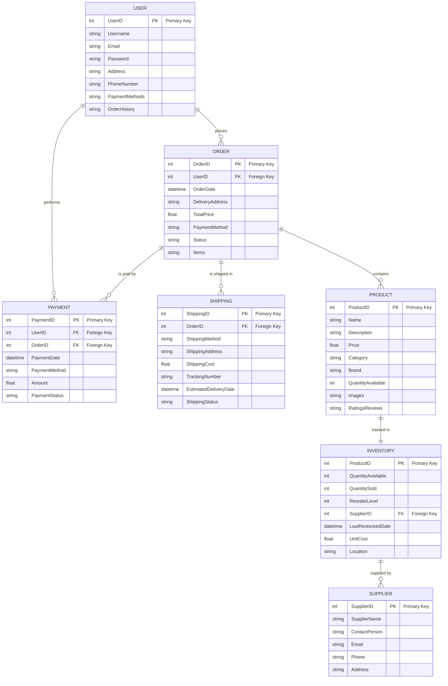
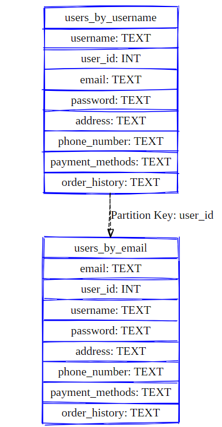
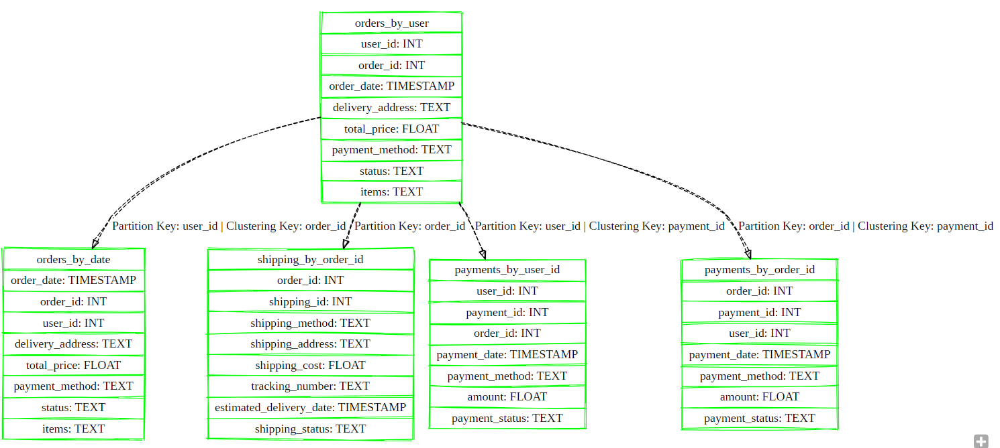
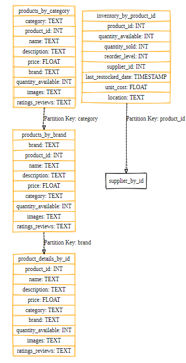
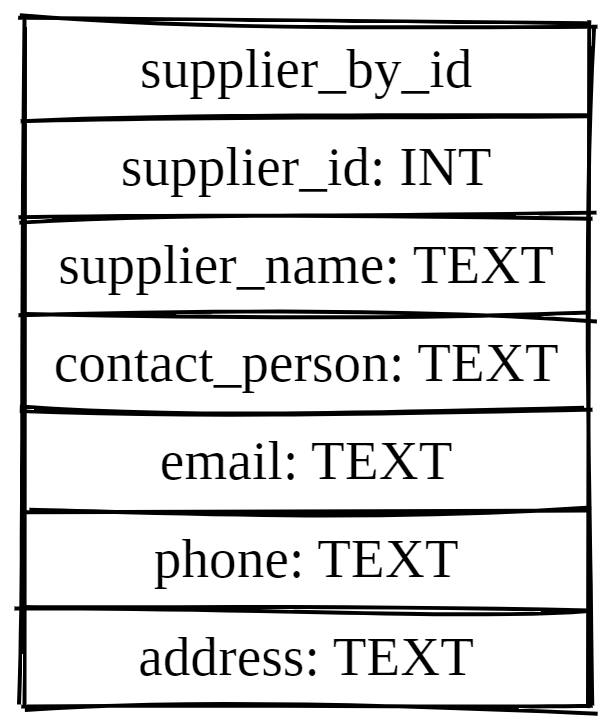

# 1. Introduction.
## Team - Champion.
1. Satyasrirama Siva Krishna Sanam.
2. Manoj Kumar Katakam.
3. Jayanth Uppara.
4. Bojanapally Santhoshini.

In the continuously evolving landscape of data-driven applications, the choice of database technology is pivotal in shaping the scalability, performance, and resilience of the system. This project embarks on the journey of translating a relational database management system (RDBMS) schema into a Cassandra schema, with a focus on catering to the unique demands of big data applications, particularly within the e-commerce domain. The scope of this endeavor encompasses a comprehensive exploration of schema translation techniques, leveraging the query-first approach to design an optimized data model tailored specifically for Cassandra's distributed architecture and NoSQL capabilities. By delving into the intricacies of schema analysis and design, the project aims to achieve several objectives to understand the underlying principles of Cassandra's data model, to identify common querying patterns and access requirements in the e-commerce landscape, and to showcase the significance of schema translation for enabling scalable, fault-tolerant, and high-performance data management. Through this exploration, the project seeks to focus on the transformative potential of transitioning from traditional RDBMS to Cassandra for accommodating the growing data volumes and dynamic querying needs of modern big data applications. The significance of this project lies in its implications for enhancing the scalability, resilience, and efficiency of e-commerce platforms, thereby empowering businesses to thrive in an increasingly data-centric environment.

## Objective:
In this assignment, we aim to design a Cassandra schema for an e-commerce platform by translating the existing relational database management system (RDBMS) schema using Query-First Approach. The objective is to leverage Cassandra's scalability and fault-tolerance for big data applications.The scope of translating the schema involves a comprehensive process focused on designing an optimized data model custom tailored for the specific querying patterns(query-first) and access requirements of the application.This involves analyzing the existing RDBMS schema to understand its structure and relationships, identifying common queries and access patterns used by the application, and designing the Cassandra schema accordingly. Key aspects include defining partition keys, clustering columns, and replication strategies to ensure efficient data distribution, query execution, and data availability. Additionally, determining the need for secondary indexes, partitioning strategies, and replication factors is essential for optimizing query performance and achieving fault tolerance. In summary, the scope encompasses a exhaustive approach to schema translation, focused on leveraging Cassandra's distributed architecture and NoSQL capabilities to meet the application's data management needs efficiently.

Converting an RDBMS schema to a Cassandra schema involves several considerations and benefits, particularly in the context of building an e-commerce application. Let's delve into the details of why this conversion is useful in many ways: 

1. **Scalability:** Cassandra is designed to scale horizontally, meaning it can handle large amounts of data by distributing it across multiple nodes in a cluster. Unlike traditional RDBMS, which can face scalability limitations, Cassandra can easily accommodate the growing data needs of an e-commerce application as the user base expands.
2. **Fault-tolerance:** Cassandra's distributed architecture ensures fault-tolerance by replicating data across multiple nodes. This means that even if some nodes fail, the system remains operational, providing high availability because of the replication of these keyvalues in the other nodes. In contrast, a single-point-of-failure scenario is more common in traditional RDBMS setups (MySQL, Postgresql etc.) this means having backup plans in place to keep operations running smoothly even if there are unexpected issues like server failures or internet problems. By having redundancy and backup systems, businesses can ensure that customers can still make purchases and access services without disruptions, protecting their revenue and reputation.
3. **Performance:** Cassandra's decentralized architecture allows for distributed data storage and parallel processing of queries, leading to improved performance for read and write operations. This is crucial for an e-commerce application where fast response times are essential for providing a seamless user experience.
4. **Flexible Data Model:** Cassandra's data model, based on wide-column stores, offers more flexibility compared to the rigid schema of RDBMS. This allows developers to denormalize data and optimize it for specific query patterns, resulting in more efficient data retrieval. In an e-commerce context, where there are various types of queries related to products, users, orders, and inventory, this flexibility is advantageous.
5. **Schema Design for Query Optimization:** By adopting a "Query First" approach, developers can design the Cassandra schema based on the application's specific query requirements. This ensures that the schema is optimized for the most frequently executed queries, resulting in better performance and resource utilization.
6. **Cost-effectiveness:** Cassandra's open-source nature and ability to run on commodity hardware make it a cost-effective solution for deploying large-scale applications. The lower infrastructure costs combined with its scalability make it an attractive option for e-commerce businesses looking to manage their growing data volumes efficiently.
7. **Resilience to Data Spikes:** E-commerce applications often experience spikes in traffic during peak shopping seasons or promotional events. Cassandra's ability to handle sudden increases in data volume and request rates without sacrificing performance ensures that the application remains responsive even during peak times.

In summary, converting an RDBMS schema to a Cassandra schema for an e-commerce application offers several advantages, including scalability, fault-tolerance, performance improvements, flexible data modeling, optimized schema design, cost-effectiveness, and resilience to data spikes. These benefits collectively contribute to enhancing the overall performance, availability, and resilience of the e-commerce platform, ultimately providing a better experience for users.

## 3. Analyze the RDBMS Schema.

**E-Commerce RDBMS Schema.**

* **User Entity:** This entity represents the users. It stores information such as user ID, username, email, address, phone number, payment methods, and order history.
* **Product Entity:** This entity contains details about the products available for purchase. It includes attributes like product ID, name, description, price, category, brand, quantity available, images, and ratings/reviews.
* **Order Entity:** The order entity tracks the details of each user's orders. It includes information such as order ID, user ID (references users), order date, delivery address, total price, payment method, order status, and items purchased.
* **Shipping Entity:** This entity manages the shipping process for orders. It tracks details like shipping ID, order ID (references orders), shipping method, shipping address, shipping cost, tracking number, estimated delivery date, and shipping status.
* **Payment Entity:** The payment entity handles transactions made by users for their orders. It stores data such as payment ID, user ID (references users), order ID (references orders), payment date, payment method, payment amount, and payment status.
* **Inventory Entity:** This entity keeps track of the available inventory of products. It includes attributes like product ID (linked to the product entity), quantity available, quantity sold, reorder level, supplier ID (references to suppliers), last restocked date, unit cost, and location.
* **Supplier Entity:** The supplier entity stores information about the suppliers providing products to the e-commerce platform. It includes details such as supplier ID, supplier name, contact person, email, phone number, and address.

**Relationships:**

- Users place orders ("places") and make payments ("performs"). Users initiate transactions by placing orders and completing payments, driving the system's revenue flow.
- Orders contain products ("contains"). Orders serve as containers for selected products, organizing purchase details for efficient processing and fulfillment.
- Orders are associated with shipping details ("is shipped in"). Shipping details are linked to orders for delivery coordination, ensuring timely receipt of purchased items.
- Orders are paid for with payments ("is paid by"). Payments are linked to orders for transaction completion, securing the exchange of goods and services.
- Products are tracked in inventory ("tracked in"). Inventory manages and monitors product availability and stock levels, facilitating efficient supply chain management.
- Inventory items are supplied by suppliers ("supplied by"). Suppliers provide inventory items for sale within the system, ensuring a consistent product offering and availability.

**Assumptions:**

- Each order can have only one shipping and payment entry.
- Products can be associated with multiple orders, hence the inclusion of the "Items" field in the ORDER table.
- The schema assumes a one-to-many relationship between orders and payments/shipping, as one order can have multiple payments/shipping details.
- Users can have multiple payment methods stored as a string, which may need further normalization for better management.
- The schema doesn't include authentication and authorization mechanisms, assuming they are handled separately.



So, in summary this schema provides a comprehensive structure for managing various aspects of an e-commerce platform, including user management, product catalog, order processing, shipping, payment handling, inventory management, and supplier relationships.

## 4. Query Analysis.

The essential queries for the application's functionality include retrieving products by category, price range, finding suppliers for a given product, checking product availability, managing inventory, and accessing user and order details.

**Step 1:**
Identify Queries.
* Q1. Retrieve user details by username or email: To retrieve the user details by username or email ID or other attributes of the user.
* Q2. Retrieve orders placed by a specific user: To retrieve all the orders placed by a particular user.
* Q3. Retrieve order details by order ID: To retrieve order details by using an Order ID.
* Q4. Retrieve all orders placed on a specific date: To retrieve all the orders that were placed on a particular date.
* Q5. Retrieve products by category: If we search for products by category then retrieve them.
* Q6. Retrieve products by brand: If we want to look at a product by their brand for example, if the user wants to look at electronic gadgets they can go with __Apple__ or __Samsung__ etc.
* Q7. Retrieve product details by product ID: If we want to retrieve the product details by the product ID.
* Q8. Retrieve inventory details by product ID: If we want to check for products that are low on stock or needs to be restocked then retrieve those details of the product by product ID.
* Q9. Retrieve supplier details by supplier ID: If we want to look at all the supplier details to know about the products and their suppliers.
* Q10. Retrieve shipping details by order ID: Also, if we want to look at the shipping details to address order processing times and optimize them.
* Q11. Retrieve payment details by user ID or order ID: If we want to look at the most used payment methods for promotional offers and to retain customers.

## 5. Design Cassandra Schema.

**Step 2:** 
Based on the identified queries, let's design the Cassandra schema:

* **users_by_username:**
   - Partition Key: username.
   - Columns: user_id, email, password, address, phone_number, payment_methods, order_history
* **users_by_email:**
  - Partition Key: email
  - Columns: user_id, username, password, address, phone_number, payment_methods, order_history
* **orders_by_user:**
  - Partition Key: user_id
  - Clustering Column: order_id
  - Columns: order_id, order_date, delivery_address, total_price, payment_method, status, items
* **orders_by_date:**
  - Partition Key: order_date
  - Clustering Column: order_id
  - Columns: order_id, user_id, delivery_address, total_price, payment_method, status, items
* **products_by_category:**
  - Partition Key: category
  - Clustering Column: product_id
  - Columns: product_id, name, description, price, brand, quantity_available, images, ratings_reviews
* **products_by_brand:**
  - Partition Key: brand
  - Clustering Column: product_id
  - Columns: product_id, name, description, price, category, quantity_available, images, ratings_reviews
* **product_details_by_id:**
  - Partition Key: product_id
  - Columns: name, description, price, category, brand, quantity_available, images, ratings_reviews
* **inventory_by_product_id:**
  - Partition Key: product_id
  - Columns: quantity_available, quantity_sold, reorder_level, supplier_id, last_restocked_date, unit_cost, location
* **supplier_by_id:**
  - Partition Key: supplier_id
  - Columns: supplier_name, contact_person, email, phone, address
* **shipping_by_order_id:**
  - Partition Key: order_id
  - Columns: shipping_id, shipping_method, shipping_address, shipping_cost, tracking_number, estimated_delivery_date, shipping_status
* **payments_by_user_id:**
  - Partition Key: user_id
  - Clustering Column: payment_id
  - Columns: payment_id, order_id, payment_date, payment_method, amount, payment_status
* **payments_by_order_id:**
  - Partition Key: order_id
  - Clustering Column: payment_id
  - Columns: payment_id, user_id, payment_date, payment_method, amount, payment_status

## 6. Query Implementation.

**Step 3**: Implementation of our identified queries with allotted keyspaces.

In Cassandra, keyspaces are used to group related tables together. They serve a similar purpose to databases in traditional relational database systems. Each keyspace contains one or more tables and defines the replication strategy for the data stored within those tables. When converting an RDBMS schema into Cassandra, it's essential to consider how to organize the tables into keyspaces. Usually one want to group tables that are related and likely to be queried together within the same keyspace. This helps in managing data locality and replication strategies effectively. In Cassandra, the primary key definition implicitly defines the partition key(s) and clustering key(s) for a table. The first component(s) of the primary key define(s) the partition key(s), and any subsequent component(s) define(s) the clustering key(s).

Let's organize the tables into keyspaces based on their relationships and access patterns:

* **Keyspace 1: User Management.**
This keyspace contains tables related to user management.

  - __Tables:__
    - 1. users_by_username.
    - 2. users_by_email.

*  **Keyspace 2: Order Management.**
This keyspace contains tables related to order management.

    - **Tables:**
      - 1. orders_by_user.
      - 2. orders_by_date.
      - 3. shipping_by_order_id.
      - 4. payments_by_user_id.
      - 5. payments_by_order_id.

    - **Materialized Views:**
      - Orders by User ID.

Retrieve orders for a specific user by their user ID. This is a common use case in e-commerce applications where users often want to view their order history or track the status of their orders. Creating a materialized view specifically for orders by user ID allows for efficient retrieval of orders associated with a particular user. By precomputing and storing the order details for each user, queries filtering by user ID can directly access the materialized view, reducing the need for full table scans or secondary indexes.        

* **Keyspace 3: Product Management.**
This keyspace contains tables related to product management.
  - **Tables:**
     - 1. products_by_category.
     - 2. products_by_brand.
     - 3. product_details_by_id.
     - 4. inventory_by_product_id.
* **Keyspace 4: Supplier Management.**
This keyspace contains tables related to supplier management.

   -   **Tables:**
       - 1. supplier_by_id.


### Keyspace 1: User Management 

```cql
CREATE KEYSPACE IF NOT EXISTS user_management
WITH replication = {'class': 'SimpleStrategy', 'replication_factor': 3};

USE user_management;

CREATE TABLE IF NOT EXISTS users_by_username (
    username TEXT PRIMARY KEY,
    user_id INT,
    email TEXT,
    password TEXT,
    address TEXT,
    phone_number TEXT,
    payment_methods TEXT,
    order_history TEXT
);

CREATE TABLE IF NOT EXISTS users_by_email (
    email TEXT PRIMARY KEY,
    user_id INT,
    username TEXT,
    password TEXT,
    address TEXT,
    phone_number TEXT,
    payment_methods TEXT,
    order_history TEXT
);
```



### Keyspace 2: Order Management.

```cql
CREATE KEYSPACE IF NOT EXISTS order_management
WITH replication = {'class': 'SimpleStrategy', 'replication_factor': 3};

USE order_management;

CREATE TABLE IF NOT EXISTS orders_by_user (
    user_id INT,
    order_id INT,
    order_date TIMESTAMP,
    delivery_address TEXT,
    total_price FLOAT,
    payment_method TEXT,
    status TEXT,
    items TEXT,
    PRIMARY KEY (user_id, order_id)
);

CREATE TABLE IF NOT EXISTS orders_by_date (
    order_date TIMESTAMP,
    order_id INT,
    user_id INT,
    delivery_address TEXT,
    total_price FLOAT,
    payment_method TEXT,
    status TEXT,
    items TEXT,
    PRIMARY KEY (order_date, order_id)
);

CREATE TABLE IF NOT EXISTS shipping_by_order_id (
    order_id INT PRIMARY KEY,
    shipping_id INT,
    shipping_method TEXT,
    shipping_address TEXT,
    shipping_cost FLOAT,
    tracking_number TEXT,
    estimated_delivery_date TIMESTAMP,
    shipping_status TEXT
);

CREATE TABLE IF NOT EXISTS payments_by_user_id (
    user_id INT,
    payment_id INT,
    order_id INT,
    payment_date TIMESTAMP,
    payment_method TEXT,
    amount FLOAT,
    payment_status TEXT,
    PRIMARY KEY (user_id, payment_id)
);

CREATE TABLE IF NOT EXISTS payments_by_order_id (
    order_id INT,
    payment_id INT,
    user_id INT,
    payment_date TIMESTAMP,
    payment_method TEXT,
    amount FLOAT,
    payment_status TEXT,
    PRIMARY KEY (order_id, payment_id)
);

CREATE MATERIALIZED VIEW IF NOT EXISTS orders_by_user_id AS
SELECT user_id, order_id, order_date, delivery_address, total_price, payment_method, status, items
FROM order_management.orders_by_user
WHERE user_id IS NOT NULL AND order_id IS NOT NULL
PRIMARY KEY (user_id, order_id);
```



### Keyspace 3: Product Management.

```cql 
CREATE KEYSPACE IF NOT EXISTS product_management
WITH replication = {'class': 'SimpleStrategy', 'replication_factor': 3};

USE product_management;

CREATE TABLE IF NOT EXISTS products_by_category (
    category TEXT,
    product_id INT,
    name TEXT,
    description TEXT,
    price FLOAT,
    brand TEXT,
    quantity_available INT,
    images TEXT,
    ratings_reviews TEXT,
    PRIMARY KEY (category, product_id)
);

CREATE TABLE IF NOT EXISTS products_by_brand (
    brand TEXT,
    product_id INT,
    name TEXT,
    description TEXT,
    price FLOAT,
    category TEXT,
    quantity_available INT,
    images TEXT,
    ratings_reviews TEXT,
    PRIMARY KEY (brand, product_id)
);

CREATE TABLE IF NOT EXISTS product_details_by_id (
    product_id INT PRIMARY KEY,
    name TEXT,
    description TEXT,
    price FLOAT,
    category TEXT,
    brand TEXT,
    quantity_available INT,
    images TEXT,
    ratings_reviews TEXT
);

CREATE TABLE IF NOT EXISTS inventory_by_product_id (
    product_id INT PRIMARY KEY,
    quantity_available INT,
    quantity_sold INT,
    reorder_level INT,
    supplier_id INT,
    last_restocked_date TIMESTAMP,
    unit_cost FLOAT,
    location TEXT
);
```



### Keyspace 4: Supplier Management.

```cql
CREATE KEYSPACE IF NOT EXISTS supplier_management
WITH replication = {'class': 'SimpleStrategy', 'replication_factor': 3};

USE supplier_management;

CREATE TABLE IF NOT EXISTS supplier_by_id (
    supplier_id INT PRIMARY KEY,
    supplier_name TEXT,
    contact_person TEXT,
    email TEXT,
    phone TEXT,
    address TEXT
);
```


## Discussion.

Overall, the project has provided valuable insights into the complexities of migrating a schema from a traditional Relational database system to Cassandra, a NoSQL database. The transition is not straightforward due to fundamental differences in the way two systems operate. One of the main challenges lies in Cassandra's preference for denormalized data organization which basicaly calls for a paradigm shift in data organization strategies, which differs from the normalized approach of traditional relational databases. While denormalization can improve search efficiency, it may lead to increased storage usage, data redundancya and data consistency issues. Additionally, distributing data effectively across Cassandra's nodes presents another challenge, akin to organizing a vast library to ensure efficient book retrieval/search where there must be a balanced distribution and efficient query performance. Managing data consistency in Cassandra requires careful consideration, as it operates differently from relational databases. Developers must anticipate schema adjustments to accommodate evolving data needs and devise smart solutions to address potential issues. Even though there are a few challenges, the advantages of Cassandra, such as its horizontal scalability and high availability, present compelling reasons for the migration. By leveraging Cassandra's decentralized architecture and flexible data model, businesses can accommodate the massive growth of data volumes and dynamic query patterns characteristic of modern applications. However, this transition is followed by trade-offs, including increased complexity in data modeling and potential overhead in managing distributed systems. Therefore, successful migration to Cassandra requires a deep understanding of its advantages and limitations, coupled with careful planning, rigorous testing, and ongoing optimization efforts to harness its full potential effectively. Through this discussion, the project underscores the importance of striking a balance between the benefits of Cassandra and the challenges inherent in its adoption, emphasizing the need for informed decision-making and meticulous implementation strategies to ensure the success of schema migration projects in data-intensive environments.The migration to Cassandra in e-commerce brings substantial benefits, as it enables platforms to adapt seamlessly to dynamic user demands and the evolving online commerce landscape. Cassandra's scalability effortlessly accommodates surges in user traffic, ensuring uninterrupted service during peak shopping periods. Its fault-tolerant design mitigates risks of system failures, safeguarding critical operations like order processing and inventory management. Additionally, Cassandra's performance optimization capabilities facilitate real-time product recommendations and personalized marketing, driving customer engagement and informed decision-making. Overall, Cassandra empowers e-commerce businesses to scale effortlessly, enhance resilience, and deliver superior customer experiences, driving growth and innovation in a competitive market. Through this project, we have gained valuable insights into Cassandra's workings and effective utilization. We now understand ways to optimize data organization for enhanced performance and navigate challenges related to data consistency and schema evolution. This knowledge will not only benefit this project but also future endeavors involving Cassandra or other NoSQL databases. Overall, the project underscores the importance of thoughtful schema design in maximizing the capabilities of NoSQL databases for modern applications like e-commerce platforms.

## Conclusion.
The migration from a traditional relational database management system (RDBMS) schema to a Cassandra schema holds a great potential for e-commerce businesses, offering a plethora of benefits and paving the way for future advancements in data management and analytics. In the evolving landscape of E-Commerce platform, scalability is paramount, given the exponential growth in data volume stemming from product listings, user registrations, and transaction records. Cassandra's horizontal scalability allows e-commerce platforms to seamlessly accommodate this growth by distributing data across multiple nodes, ensuring optimal performance even as the user base expands. This scalability translates into improved resilience to handle spikes in traffic during peak shopping seasons or promotional events, safeguarding against revenue loss and maintaining customer satisfaction. Fault-tolerance is another critical aspect for e-commerce platforms, where downtime can have severe consequences on revenue and brand reputation. Cassandra's distributed architecture and replication strategies provide inherent fault-tolerance by replicating data across nodes, mitigating the risk of disruptions due to hardware failures or network issues. This ensures continuous availability of the platform, instilling confidence in customers and fostering long-term loyalty. Moreover, Cassandra's decentralized approach to data storage and processing enhances performance, enabling faster response times for read and write operations compared to traditional RDBMS systems. In the competitive e-commerce landscape, where every millisecond counts, this performance boost can make a significant difference in delivering a seamless user experience and gaining a competitive edge. The flexibility of Cassandra's data model empowers e-commerce businesses to adapt to evolving requirements and diverse data types seamlessly. By denormalizing data and optimizing it for specific query patterns, businesses can improve data retrieval efficiency and analytical capabilities. This optimization is further bolstered by Cassandra's query-first approach, which allows developers to design the schema based on the application's specific querying needs, ensuring optimal resource utilization and improved overall system performance. Additionally, Cassandra's cost-effectiveness, coupled with its ability to run on commodity hardware, makes it an attractive proposition for e-commerce businesses looking to manage growing data volumes without breaking the bank. Looking ahead, the migration to a Cassandra schema opens up exciting prospects for e-commerce businesses to explore advanced analytics, real-time personalization, blockchain adoption, and edge computing. These advancements have the potential to revolutionize the way e-commerce platforms operate, enabling them to gain deeper insights into customer behavior, deliver personalized shopping experiences, enhance data security and transparency, and optimize operational efficiency. By leveraging Cassandra's scalability, fault-tolerance, and performance capabilities, e-commerce businesses can future-proof their operations and stay ahead of the curve in an increasingly competitive market. In summary, the project successfully translated a relational database management system (RDBMS) schema into a Cassandra schema tailored for e-commerce applications, demonstrating a deep understanding of Cassandra's distributed architecture and NoSQL capabilities. Through meticulous schema analysis and design, the project optimized data models to enhance scalability, fault-tolerance, and performance, addressing key querying patterns and access requirements. By organizing tables into keyspaces and leveraging the query-first approach, the project showcased the transformative potential of transitioning from traditional RDBMS to Cassandra, offering benefits such as flexible data modeling, optimized schema design, and resilience to data spikes. Overall, the project's comprehensive summary underscores its high level of insight and foresight in addressing the evolving needs of data-driven applications in the modern landscape. Furthermore, this project serves as a valuable learning opportunity for understanding the complexities of schema design in a distributed database environment. By diving deep into the process of schema translation from RDBMS to Cassandra, one can understand essential concepts such as partition keys, clustering columns, and replication strategies. Moreover, the advantages of this project extend beyond theoretical knowledge, offering practical insights into real-world applications. Database developers can apply the principles learned here to optimize data models for various domains, not just limited to e-commerce but also spanning social media platforms, IoT systems, and more. The advantages of leveraging Cassandra's scalability, fault-tolerance, and performance optimizations are evident, building the way for robust and resilient applications capable of handling massive data volumes and dynamic workloads. Through this project, individuals gain proficiency in harnessing the full potential of NoSQL databases like Cassandra, empowering them to architect sophisticated data solutions tailored to the demands of modern, data-driven ecosystems.


