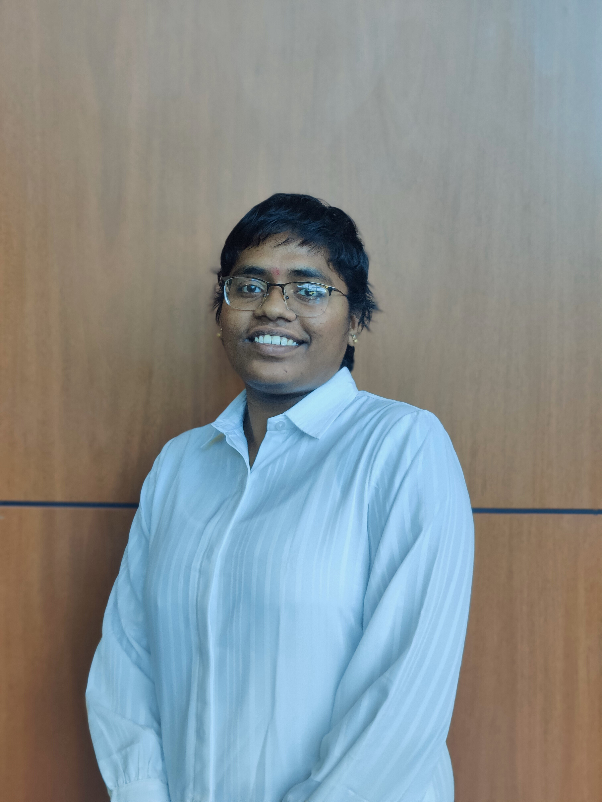

# Bojanapally Santhoshini

## Introduction

As a Data enthusiast with a Bachelor's degree in Biotechnology to a Master's degree in Business Analytics & Information Systems my journey has been nothing but exciting. I had many opportunities to explore the curious world of data in diverse concentrations Biotechnology, Real estate and HealthCare. Exploring data world in these industries broadened my skill set also equipped me with the skills to derive acute insights from data through data exploration and better understand data. In this quest of mine to explore data, I hope to equip myself with novel skills and establish my career as a skilled data professional. My interests apart from academics and career would be gardening and reading books in mystery and fantasy genre.

.
