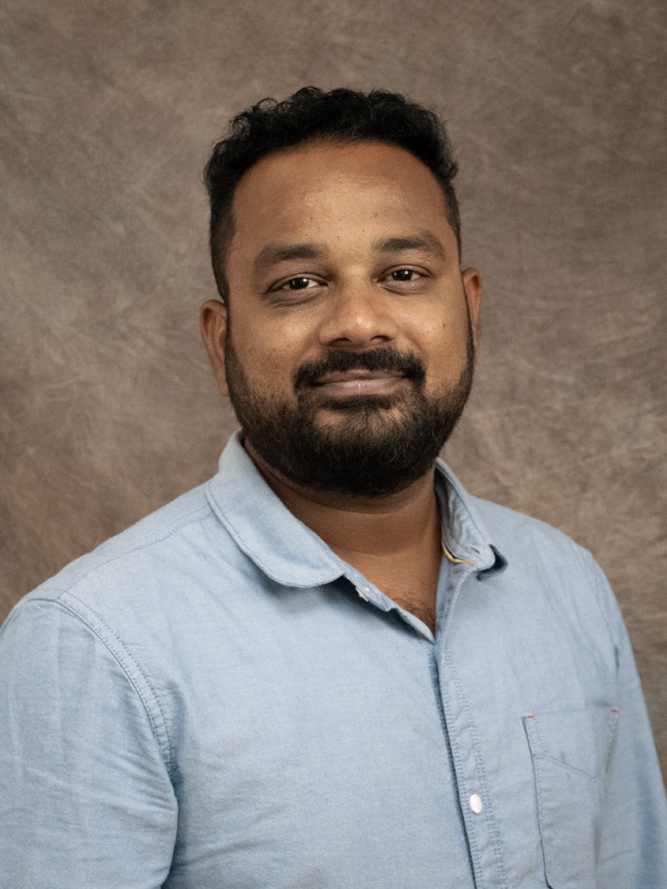

ManojKumar_Katakam

### Introduction

I've worked in software development for over eight years, focusing on IBM AS/400 tech like COBOL/400, RPG/400, and CL/400. I've got a lot of experience in Insurance. Now, I'm studying for a Master's degree in Business Analytics and Information Systems at the University of South Florida because I want to get into data science. My goal is to use data science to look at complicated data, find important information, and help make smart decisions for businesses. I'm really interested in using machine learning to guess future trends and help companies plan better and work more efficiently. As I work towards becoming a Data Scientist, I want to make difficult data easy to understand and use, using advanced analysis and making the data easy to see and understand.

### Image:

